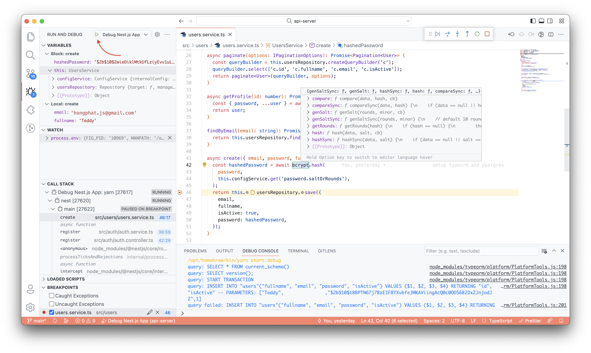

# NestJS Server API

## Project structure

The project is a [Nest.js](http://nestjs.com) application that consists of multiple modules:


<!-- 

-->

- **Application Module**: root module, the entry point of the application where configurations are also loaded
- **Auth Module**: handle the logic for authentication/authorization users from the mobile application
- **User Module**: manage users in our application
- **Chat Module**: handle chat logic
- **Travel Module**: travel features's module
- **Admin Module**: provide controller(s) for the API endpoint that is consumed from the Admin Portal. Also, handle the logic for authentication/authorization admins. Admin Module might depend on other feature modules.

Besides internal modules, some other modules are also used: [TypeOrmModule](https://docs.nestjs.com/techniques/database), [JwtModule](https://docs.nestjs.com/security/authentication#jwt-functionality), [ConfigModule](https://docs.nestjs.com/techniques/configuration),...

## Module structure

Inside each module:

- \*.controller.ts: controller, for handle routing and ResfulAPI logic
- \*.service.ts: reusable business logic
- \*.entity.ts: TypeORM entities. **Remember to [generate migrations](#generate-migration) whenever entities are updated**
- \*.dto.ts: data transfer object, should be annotated with [Swagger @ApiProperty()](https://docs.nestjs.com/openapi/types-and-parameters) for documentation
- \*.guard.ts: custom guards
- \*.strategy.ts: Passport.js strategy to handle local authentication/authorization logic
- \*.spec.ts: unit test _(optional, based on workload and requirement changes)_
- \*.e2e-spec.ts: e2e test case (recommended)
- **\*.module.ts**: module definition, where other components of the module are registered. Required for every module!

## Other project files/folders

- migrations: where all migrations are stored
- data-source.ts: database connection setup, for both Nest.js application and [TypeORM CLI](https://typeorm.io/using-cli)
- config.ts: global configuration, use `.env` file to load values. To access config, use [ConfigService](https://docs.nestjs.com/techniques/configuration#using-the-configservice)

  **Please don't use `process.env` in any file except `config.ts`**. Except for `data-source.ts`, which is an exception!

- swagger.config.ts: Swagger configuration, such as path (default to `/api` and `/admin/api`), version and descriptions,...
- main.ts: Nest.js application entry point. You might not wish to touch this!
- test: E2E test cases
- .env.example: Example configuration, which you can `cp .env.example .env` and put your local configurations/secret there
- .env: (ignored by git) environment configurations
- .vscode/launch.json: Visual Studio Code launch configuration, with this you can debug this project by pressing `F5`

## Setup

### Installation

Clone this repository and install dependencies (please use `yarn` for all the operations)

```bash
$ yarn
```

### Environment

Clone the example environment file:

```bash
cp .env.example .env
```

The required configurations are:

- DB_HOST: Database host, default to `localhost`
- DB_PORT: Database port, default to 5432
- DB_USERNAME: Database username
- DB_PASSWORD: Database password
- DB_NAME: Database name
- APP_SECRET: JWT token's secret key, used for signing. You can generate one by:
  ```bash
  openssl rand 256 | base64
  ```
  or
  ```
  node -e "console.log(require('crypto').randomBytes(256).toString('base64'));"
  ```

### Running the app

```bash
# development
$ yarn start

# watch mode
$ yarn start:dev

# production mode
$ yarn start:prod
```

### Debugging

Use Visual Studio Code and launch the `Debug Nest.js App` target:



### Test

```bash
# e2e tests
$ yarn test:e2e
```

## Recipes

### Database migrations

To apply migrations:

```bash
yarn migrate:up
```

To revert migrations:

```bash
yarn migrate:down
```

<a name="generate-migration"></a>
To generate migration after entity update:

```bash
yarn migrate:generate src/migrations/name-of-the-migration
```

_Remember to put all migrations inside `src/migrations/*` folder. In the future, we might only need to type the migration name for this command (`yarn migrate:generate name-of-the-migration`), but for now, a relative path is required! (Read more: https://github.com/typeorm/typeorm/issues/8762#issuecomment-1179418790)_

### Protect controllers

Put `@Authorized()` annotation before a controller if all endpoints in it must be logged in before using.

For detail, this custom annotation is composed of:

- @UseGuards(JwtAuthGuard): use middleware to check for JWT token
- @ApiBearerAuth(): Swagger won't put provided access token inside Authorization headers for these requests without this annotation
- @ApiUnauthorizedResponse({ description: 'Unauthorized' }): Document the 401 result for the endpoint

### Retrieve the logged-in user

```ts
@RequestUser() user: CurrentUser
```

### Swagger Documentation

API must be annotated with Swagger's documentation annotation (or at least APIs for the mobile application):

- Payload:
  ```ts
  @ApiBody({
    type: CheckinDto,
  })
  // or better
  @Body() checkinParams: CheckinDto
  ```
- Happy case result:
  ```ts
  @ApiResponse({
    status: 200,
    description: 'Purpose of the API',
    type: ResponseDto,
  })
  ```
- Error result: (if you use the `@Authorized()` annotation, error 401 result are already documented)
- API tag: one for each controller:
  ```ts
  @ApiTags('users')
  ```

And don't forget to change the version inside `swagger.config.ts`.

## Documentation

- [Nest.js](http://nestjs.com/)
- [TypeORM](https://typeorm.io)
- [Passport](http://www.passportjs.org)
- [PostgreSQL](https://www.postgresql.org)
- [Swagger](https://swagger.io)
- [TypeScript](https://www.typescriptlang.org)
